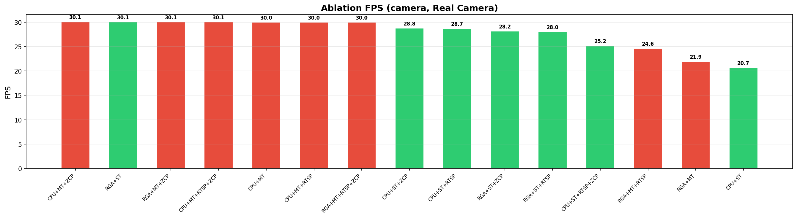
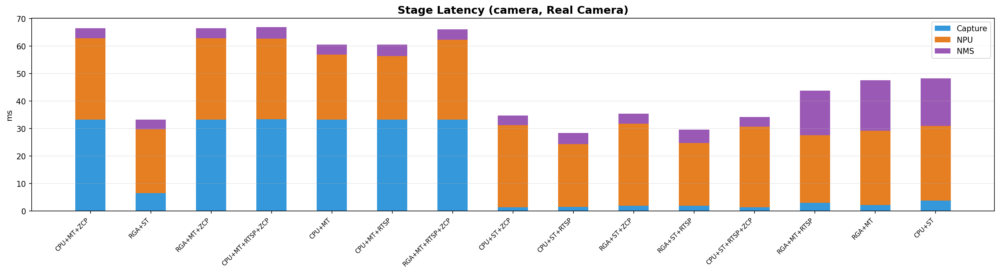
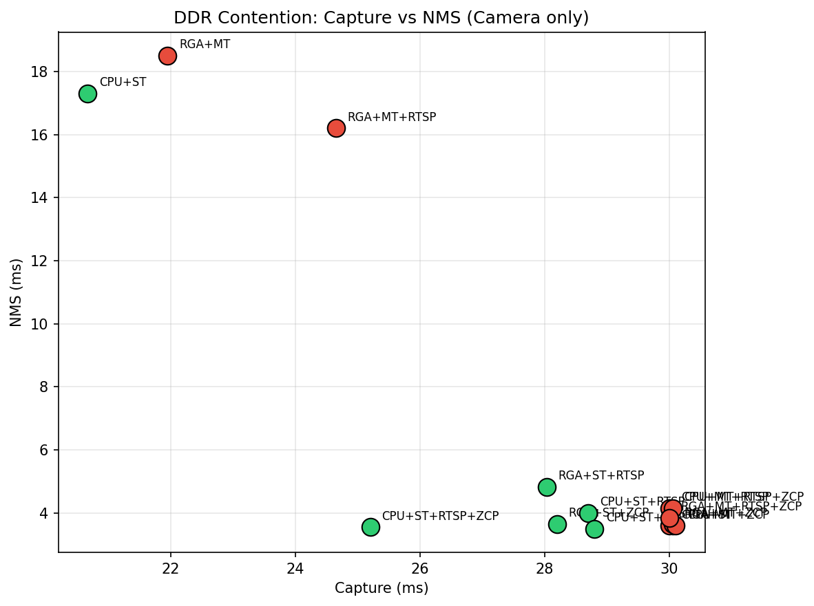
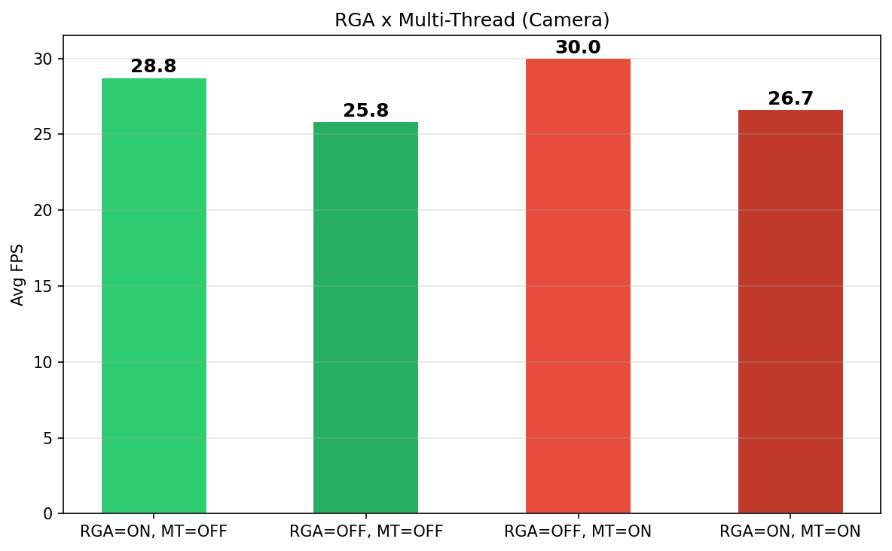
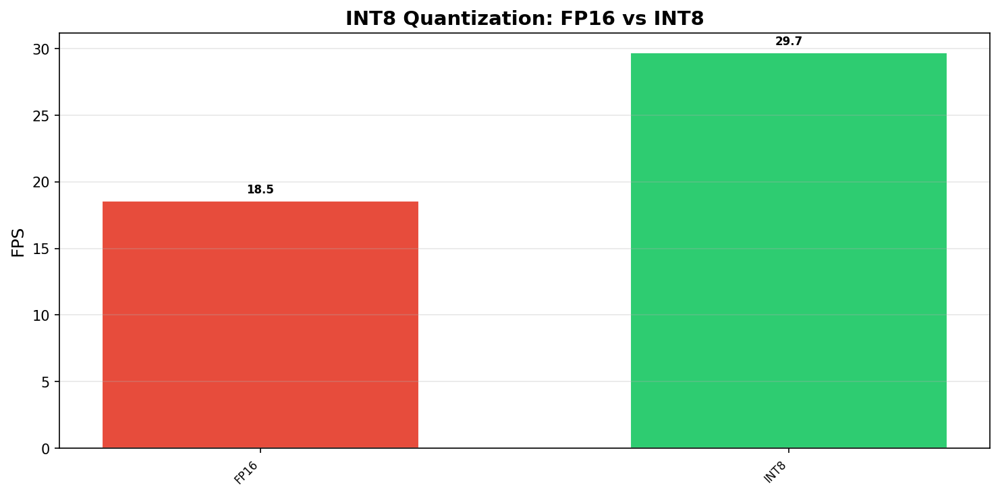
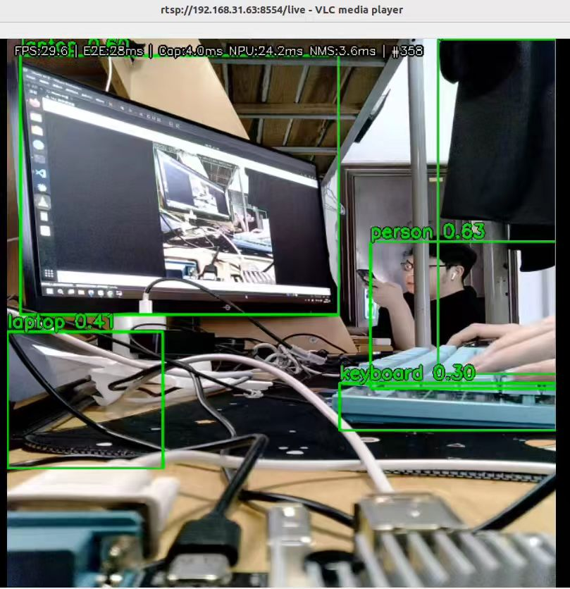
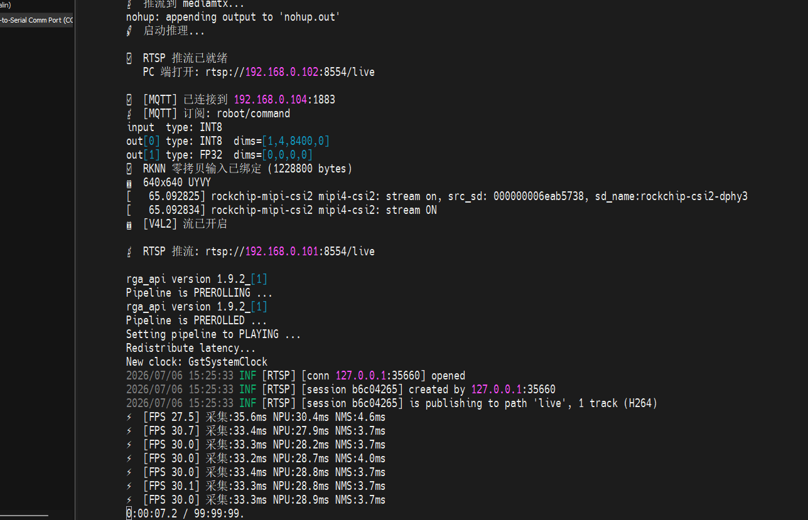

# YOLO26n-RKNN-Deploy

[](https://www.rock-chips.com/)
[]()

纯 C++ RK3588 端侧实时目标检测管线——V4L2 摄像头采集 → RGA 硬件预处理 → INT8 NPU 推理 → MPP 硬编码 → RTSP 推流。

---

## 系统架构

```
┌────────────────── RK3588 ──────────────────────┐       ┌─ 笔记本 ───────────┐
│                                                 │       │                    │
│  MIPI 摄像头 (IMX415)                           │       │  MQTT Broker        │
│    │ UYVY 1920×1080                             │       │    │               │
│    ▼                                            │       │    ├─ perceiption  │
│  V4L2 采集 (手写 Multiplanar)                    │       │    └─ perf log     │
│    │                                            │       │                    │
│    ▼                                            │       │  VLC / ffplay      │
│  RGA 硬件预处理                                  │       │    │               │
│  UYVY→RGB + 1080→640 (imresize, ~1ms)           │       │    rtsp://         │
│    │                                            │       │                    │
│    ▼                                            │       └────────────────────┘
│  NPU 推理 (YOLO26n, INT8, 25ms)                  |        ▲         ▲
│    │ 0 号输出: bbox [4×8400]                     │        │         │
│    ├ 1 号输出: score [80×8400]                   │        │        MQTT
│    ▼                                             │        │
│  NMS 后处理 → 检测框                              │        │
│    │                                             │        │
│    ├── 安全状态机 (硬实时, 不依赖网络)             │        │
│    ├── MQTT 上报 (JSON) ─────────────────────────┘        │
│    └── 可视化 → NV12 → FIFO                       │        │
│                            │                      │       │
│                            ▼                      │       │
│                      GStreamer pipeline:          │       │
│                      videoparse → mpph264enc      │       │
│                      → h264parse → tcpserversink  │       │
│                            │                      │       │
│                            ▼                      │       │
│                      ffmpeg: H264 TCP → RTSP      │       │
│                            │                      │       │
│                            ▼                      │       │
│                     mediamtx: RTSP Server (:8554) │       │
│                            │                      │       │
│                      rtsp://板子IP:8554/live ──────┘      │
└───────────────────────────────────────────────────────────┘

```
<details>
<summary>📱 移动端/自适应架构图 (点击展开 Mermaid)</summary>

```mermaid
graph TD
    subgraph RK3588_End_Edge
        A[MIPI IMX415<br/>UYVY 1080p] -->|V4L2 Multiplanar| B[V4L2 Capture]
        B -->|DMA-BUF| C[RGA Hardware<br/>UYVY→RGB 1080→640]
        C -->|RGB Tensor| D[RKNN NPU<br/>YOLO26n INT8]
        D -->|Bbox & Score| E[CPU Post-process<br/>NMS]
        E --> F{Safety State Machine}
        E --> G[MQTT JSON]
        E --> H[NV12 Overlay]
        H -->|Named Pipe| I[GStreamer + MPP]
        I --> J[mediamtx RTSP]
    end
    
    subgraph Host_PC
        K[MQTT Broker]
        L[VLC / ffplay]
    end
    
    G -.->|WiFi/Ethernet| K
    J -.->|rtsp://| L
## 硬件与性能

| 项目 | 说明 |
|------|------|
| **芯片** | RK3588 (3×NPU, 1×RGA, 1×VPU, 4-ch LPDDR5) |
| **摄像头** | IMX415 MIPI, 1920×1080, UYVY |
| **模型** | YOLO26n, 80类, 640×640, INT8 (ONNX 图手术) |
| **最高 FPS** | **30.1** (CPU + 单线程, 无推流, INT8) |
| **推流 FPS** | **29.6** (RGA + 单线程 + RTSP, INT8) |
| **FP16 FPS** | 16.9 (RGA + 单线程 + RTSP) |
| **NPU(INT8)** | ~23ms (较FP16的48ms降 52%) |
| **采集** | 3.9ms (RGA, 较CPU降 40%) |
| **零拷贝** | 不适用本项目 (需RGA直写NPU DMA, CPU memcpy反而慢6ms) |

### 消融实验 (8 配置, 摄像头实测, INT8, ZCOPY=0, 2026-07-05)

| # | RGA | MT | RTSP | FPS | capt | NPU | NMS | E2E |
|---|-----|----|------|-----|------|-----|-----|-----|
| 1 | 0 | 0 | 0 | 30.1 | 5.8 | 24.2 | 3.2 | — |
| 2 | 0 | 0 | 1 | 28.5 | 6.3 | 24.3 | 3.4 | ~28 |
| 3 | 0 | 1 | 0 | 28.0 | 22.0 | 25.1 | 7.2 | — |
| 4 | 0 | 1 | 1 | 29.8 | 8.2 | 24.9 | 8.9 | ~200 |
| **5** | **1** | **0** | **1** | **29.6** | **3.9** | **23.2** | **4.2** | **~28** |
| 6 | 1 | 0 | 0 | 20.4 | 7.1 | 25.7 | 16.5 | — |
| 7 | 1 | 1 | 0 | 30.1 | 33.3 | 24.3 | 3.5 | — |
| 8 | 1 | 1 | 1 | 22.2 | 4.6 | 26.5 | 17.0 | ~200 |

> **最优: #5 (RGA+ST+RTSP), FPS 29.6, E2E 28ms。** 多线程 FPS 不升反降且 E2E 暴涨到 200ms+（队列背压）。

### RGA 开关对比 (单线程, ZCOPY=0, RTSP=0)

| RGA | FPS | capt | NPU | NMS |
|-----|-----|------|-----|-----|
| 关 | 30.1 | 5.9 | 23.7 | 3.6 |
| **开** | **30.4** | **4.0** | **23.0** | **3.6** |

> RGA 下 capture 降 32%, NPU 和 NMS 持平。纯推理场景 RGA 开/关 FPS 相近，加 RTSP 后 RGA 优势更明显（capt 省的时间被推流吃掉）。

### E2E 延迟对比 (INT8, RTSP=1, ZCOPY=0)

| 配置 | E2E | 说明 |
|------|-----|------|
| RGA + ST | **28ms** | 稳定, 无队列堆积 |
| RGA + MT | ~200ms | 主线程被 fwrite 阻塞, q2 堆帧 |
| CPU + MT | ~200ms | 同上, 多线程通病 |

### 核心发现: DDR 带宽是零和游戏

```
capture 和 NMS 严格互斥 —— 不可能同时快:

RGA+MT(配置7):    capt=33.3ms  NMS=3.5ms   ← CPU采集被NPU挤掉, NMS吃饱
RGA+MT(配置8):    capt=4.2ms   NMS=16.1ms  ← RGA DMA抢赢, NMS饿死
RGA+ST(配置5):    capt=3.6ms   NMS=4.4ms   ← 串行, 各自独占DDR
```

**开了多线程后，总有一个阶段在 DDR 排队。RK3588 的 DDR 子系统（4-ch LPDDR5, 峰值 34GB/s）虽然带宽充裕，但多个 DMA 主控（RGA/NPU/CPU/VPU）同时访问时，DDR 控制器按优先级和 bank 冲突调度请求，导致各模块互相等待。单线程各模块独占控制器，稳定且可预测。**

### 零拷贝实验结论

```
ZCOPY=0（推荐）:  FPS 30,  NPU 23ms,  检测正常
ZCOPY=1:          FPS 25,  NPU 29ms,  检测减少
```

零拷贝的 `memcpy` 是 CPU 往 uncached DMA 内存写 1.2MB——比 `rknn_inputs_set`（NPU 自带的 DMA 引擎从 CPU 内存拉）慢 ~6ms。单线程下这 6ms 直接加在 NPU 阶段上，检测还变少（uncached write 数据不一致）。**零拷贝需要 RGA 直接 DMA 写到 NPU 输入 buffer 才有效，本项目的 RGA→CPU→NPU 数据流不满足条件。**

### INT8 量化效果

| 版本 | FPS | capt | NPU | NMS |
|------|-----|------|-----|-----|
| FP16 (未量化) | 18.5 | 15.0 | 50.5 | 3.3 |
| **INT8 (量化)** | **29.8** | 17.8 | **24.9** | 8.7 |
| **变化** | **+61%** | +19% | **-51%** | +164% |

> NPU 耗时减半 (50→25ms)，FPS 跃升 61%。这是本项目最大的单次性能跳变。







## 快速开始

### 1. 编译 (交叉编译)

```bash
# PC 端 (需要 arm64 交叉编译器)
cd convert_cpp
./build-linux.sh

# 推送到板端
scp -r build root@<rk3588-ip>:~/yolo_deploy/
adb push ./build  /home/topeet/code/build/
```

### 2. 板端首次部署

```bash
# 下载 mediamtx (RTSP 服务端)
mkdir -p ~/yolo_deploy/tools && cd ~/yolo_deploy/tools
wget https://github.com/bluenviron/mediamtx/releases/download/v1.11.3/mediamtx_v1.11.3_linux_arm64v8.tar.gz
tar xzf mediamtx_v*.tar.gz && rm mediamtx_v*.tar.gz
cat > mediamtx.yml << 'EOF'
rtspAddress: :8554
rtspTransports: [udp, tcp]
paths:
  live:
    source: publisher
EOF
```

### 3. 运行

```bash
cd ~/yolo_deploy
./start_rtsp.sh                    # 一键启动 (模型/RTSP/采集)

# PC 端观看
vlc rtsp://192.168.0.101:8554/live
# 或
ffplay -fflags nobuffer -flags low_delay rtsp://192.168.0.101:8554/live
```

### 4. MQTT 日志 (PC端)

```bash
cd tools && g++ -std=c++17 mqtt_logger.cpp -lmosquitto -o mqtt_logger
./mqtt_logger 192.168.0.104

# 自动生成 perf_rga1_mt0_rtsp1.txt 等文件
```

## 功能开关

所有开关在 [include/config.h](include/config.h)：

```c
#define USE_RGA          1     // RGA 硬件预处理 (1=开, 0=CPU fallback)
#define USE_MULTITHREAD  0     // 三线程管线 (1=多线程, 0=单线程)
#define USE_RTSP         1     // RTSP 推流 (1=推, 0=不推)
#define USE_ZCOPY        0     // RKNN 零拷贝 (不推荐, 见文档)
#define USE_VIDEO        0     // 图片循环测试模式
```

改一个宏，重新编译即可跑 A/B 对比。

## 目录结构

```
convert_cpp/
├── src/main.cpp                    # 主程序 (~300行, 管线调度)
├── include/
│   ├── config.h                    # 全局配置 + 功能开关
│   ├── core/
│   │   ├── pipeline.h              # 线程安全队列 SafeQueue<T>
│   │   ├── preprocess.h            # CPU 预处理
│   │   └── postprocess.h           # NMS 后处理
│   ├── io/
│   │   ├── camera_capture.h        # V4L2 采集 (Multiplanar)
│   │   ├── mqtt_publisher.h        # MQTT 通信 (mosquitto)
│   │   ├── json_output.h           # 结构化 JSON
│   │   ├── overlay.h               # 画面叠加 + NV12 推流
│   │   └── coco_names.h            # COCO 80 类名
│   ├── hw/
│   │   ├── rga_preprocess.h        # RGA 硬件缩放+转色
│   │   └── mpp_encoder.h           # MPP 硬编码
│   └── safety/
│       └── safety_state.h          # 安全状态机
├── process/
│   ├── preprocess.cpp              # 预处理实现
│   └── postprocess.cpp             # NMS 实现
├── tools/
│   ├── mqtt_logger.cpp             # MQTT 日志接收器
│   ├── test_rga.cpp                # RGA 最小测试 (4级逐级验证)
│   └── mediamtx.yml                # RTSP 服务端配置
├── start_rtsp.sh                   # 一键启动
├── stop_rtsp.sh                    # 一键停止
├── CMakeLists.txt                  # CMake (交叉编译)
├── build-linux.sh                  # 一键编译+打包
└── docs/
    └── 项目开发全记录.md              # 完整踩坑记录 + 问题解决
```

## 技术点

- **ONNX 图手术**: 拆分输出层, bbox 和 class score 各自独立 INT8 量化 scale, NPU 50ms→25ms
- **RGA 硬件加速**: posix_memalign 页对齐 + mlock 锁内存解决 DMA get_user_pages 失败, capture 18ms→3.6ms
- **V4L2 Multiplanar**: 直连 ISP 输出, 跳过 OpenCV/libv4l2 中间层, 零额外拷贝
- **MPP + RTSP**: 4 进程链路 (C++→FIFO→GStreamer→ffmpeg→mediamtx), MPP 硬编码零 CPU 开销
- **DDR 争抢分析**: 9 配置全链路对比, 定位 RK3588 DDR 总线为系统瓶颈

## 截图






